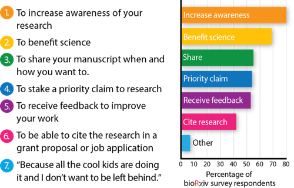

---
title: "SFB1315 Result Gallery"
subtitle: "what is the point?"
author: "Thomas Lemberger and Julien Colomb, "
institute: "Sourcedata/SFB1315"
date: "2019-10-24 (updated: `r Sys.Date()`)"
output:
  xaringan::moon_reader:
    css: ["default", "kunoichi", "ninjutsu","logo.css" ]
    chakra: libs/remark-latest.min.js
    lib_dir: libs
    nature:
      highlightStyle: github
      highlightLines: true
      countIncrementalSlides: true
      titleSlideClass: ["right", "top", "my-title"]
---
class: middle

# Objectives:

- Collecting wishes, taking preprints as an idea catalyst

--

- Discuss research figures using the Result gallery tool

???

Participative start: either ask people to stand up and move left/right as answers to the questions, or (if the room is too small for that) get people to stand up/sit as answers to the questions.

- who has heard of bioarchiv?


---

background-image: url(https://www.biorxiv.org/sites/default/files/site_logo/bioRxiv_logo_homepage.png)

```{r setup, include=FALSE}
options(htmltools.dir.version = FALSE)
```

???

- who knows this (bioarchiv logo visible)
- who reads "article" there?
- who wrote pre-published an article there?


---
class: center, middle


# Preprints

> What do you know about preprints ?

???
keep it short, 2 min max.
---
class: my-one-page-font


# What is the difference between preprints and articles?


--

- Peer review (but see reviewcommons)
--

- xml,html version (but see bioarchiv)
--

- index (but see europe PMC)
--

- reputation build (but see altmetrics)
--

- **CC-BY and free**: no paywall, no APCwall (diamond open access)

???

this might be expanded
---
background-image: url("figures/reviewcommons.png")
background-position: center
background-size: contain
---

class: split-three white center

.row.bg-main1[.content.vmiddle[
# Your experience reading preprints?
]]

.row.bg-main2[
.split-two[
.column[

# +
]
.column[
# -
]
]
]
.row.bg-main2[

]

???

Write on the board:

- raise awareness
- good for science
- share
- anti-scooping
- feedback
- cite
- other
---
class: split-three white center

.row.bg-main1[.content.vmiddle[
# Your experience writing preprints?
]]

.row.bg-main2[
.split-two[
.column[

# +
]
.column[
# -
]
]]

.row.bg-main2[ 

]

???

Write on the board, classed in:

- raise awareness
- good for science
- share
- anti-scooping
- feedback
- cite
- other


---
layout: true
class: split-two white 

.row.bg-main3[.content.vmiddle[

# SFB Result Gallery: 

# ASAP dissemination of information in the SFB
]]

.row.bg-main4[
.split-three[
.column[.content[
    
## As Soon As Possible

- not publication-ready
- easy workflow, minimal effort

]]


.column[.content[

## Information
    
- Smallest unit of sharable research output is a figure panel
- A figure needs some context to be understandable     
    ]]


.column[.content[

## dissemination

- Smart figures are either private or SFB shared 

    ]]    
    
  
  ]

]


---

class: hide-row2-col1 hide-row2-col2 hide-row2-col3 with-border

---

class:  hide-row2-col2 hide-row2-col3 with-border
count: false
---

class:   hide-row2-col3 with-border
count: false
---

class:   with-border
count: false


---
layout: false

# Personal objectives for upload

.pull-left[

Preprints:

```{r , echo=FALSE}

```

]

.pull-right[
Result Gallery:

- Increase awareness (foster collaboration)
- Benefit science (speed up communication)
- Share
- Get early recognition
- **receive feedback**
- Get statistics for the DFG (# figures, # dataset linked)
- Foster discussion in the SFB

]

---

# Personal objectives for reading/commenting

.pull-left[

Preprints:

```{r , echo=FALSE}

```

]

.pull-right[
Result Gallery:

- *Keep up with the news (foster collaboration)*
- Benefit science (speed up communication)
- Share
- Get early recognition
- **give feedback**
- Get statistics for the DFG ( # comments)
- Foster discussion in the SFB

]

???

you get to know things before the rest of the world, probably some relevant things for your work.


---
class: center, middle


# let's have a look and do some science:

https://adoring-tereshkova-f0b719.netlify.com


# Thanks!

Slides created via the R package [**xaringan**](https://github.com/yihui/xaringan).

The chakra comes from [remark.js](https://remarkjs.com), [**knitr**](http://yihui.name/knitr), and [R Markdown](https://rmarkdown.rstudio.com).

???

# SFB output website:

- Open Result Gallery
- Blog
- Link to publications list
- other (open) outputs
    - software
    - datasets
    - reagents (virus, animals,...)
    - protocols

## What would you like to see there ?

---

- tour (10 min)
    - register/login
    - have a look
    - upload a figure

Science (25 min)
    - discuss with the group about the title and text
    - add comments, discuss the figure, do science
    - if time left, reiterate  
  
